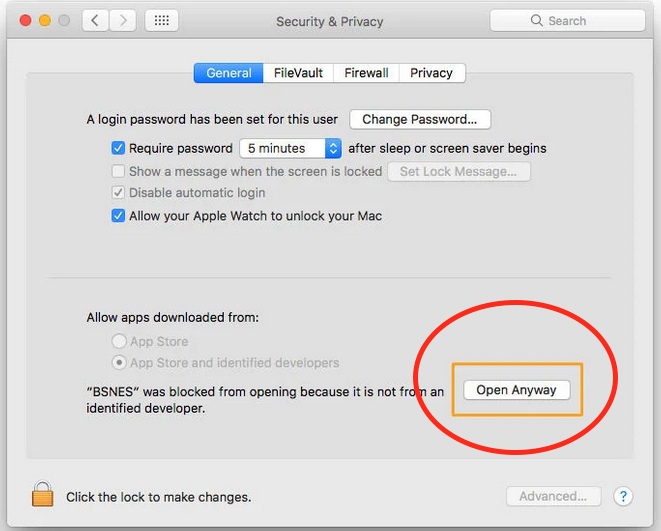
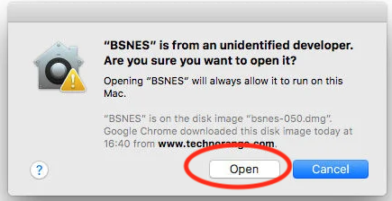
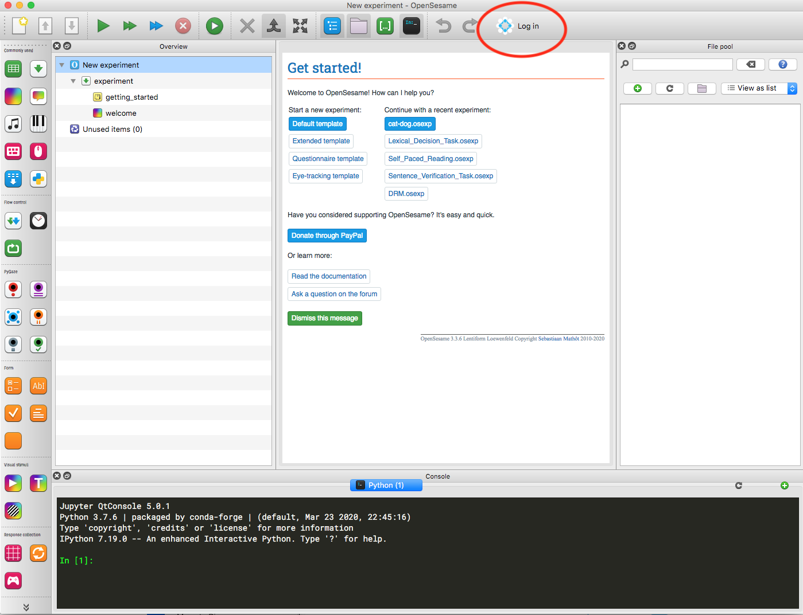

```{r setup, include=FALSE}
knitr::opts_chunk$set(echo = TRUE)
```

```{r klippy, echo=FALSE, include=TRUE}
# install.packages("remotes")
# remotes::install_github("rlesur/klippy")
klippy::klippy(position = c('top','left'))
```


<!-- ```{r, class.source='klippy', eval=FALSE} -->
<!-- an example klippy -->
<!-- ``` -->

<!-- This document explains how to  use opensesame for CaL in 2021 -->

# Register for an account with OSF
* at https://osf.io/register/ (you might need to copy and paste that link into a browser if clicking on it doesn't work)
  * Use your BU email address
  * Use your real full name including any middle name
  * Use a strong password with a number, a capital letter, and a special symbol like $ - or the OSF will not accept your password
  * You will need to type your password again later and in future weeks - you might want to write it down on a bit of paper or save it to a text file together with any other CaL files that you keep on your computer. Please use a password that is different from any passwords that you use for anything sensitive like internet banking. The idea is that the password should be strong enough to satisfy the OSF, but that if someone malicious saw it, they would only have access to your OSF account.
* Check your BU email for an account confirmation email from OSF - it will have a link that you copy into a browser to confirm your account.
* Turn off notifications at https://osf.io/settings/notifications/ - in particular turn 'files updated' to 'Never' (see screenshot below)
* Email me the real full name that you used to create your account
  * I need this to search for you on the OSF so that I can grant your account access to the CaL experiments
  * the subject field should be like this 'CaL 2021 Matthew James Green' - replace Matthew James Green with the real full name you used to create your account
  * my address is mgreen@bournemouth.ac.uk
  * when I have added you I will send an empty reply to your email - when you get that, the process of registering for an OSF account for CaL is complete


# Install OpenSesame
OpenSesame is available for free from their homepage. AppsAnywhere has an out of date version for Windows 10, but not for Mac. I recommend that you use the version from the OpenSesame homepage at https://osdoc.cogsci.nl/3.3/download/ You will find installers for Mac and Windows - I recommend that you use the ones circled in red in the screenshot below. If you are using linux and you aren't sure what to do then email me at mgreen@bournemouth.ac.uk.


## If you are using Windows
If you are using Windows then the installer should run fine.

## If you are using a Mac
If you are using a Mac, then depending on your existing settings, you might need to tell your Mac that you really do want to install OpenSesame if it refuses at first. If you attempt to open an app and macOS stops you from doing so, that doesn't necessarily mean there is something wrong with the app. But it will indicate that the app isn't from an 'identified developer' - in other words a developer that has signed up to Apple's developer program and jumped through a few hoops to get Apple to trust it. However you can still open the app and override the block. Here's how:

* Open System Preferences.
* Go to Security & Privacy and select the General tab.
* If you've been blocked from opening an app within the past hour, this page will give you the option to override this by clicking the temporary button 'Open Anyway'.



* You'll be asked one more time if you're sure, but clicking Open will run the app. 



* This creates an exception for that app, so you'll also be able to open it in the future without having to repeat this process. Because of Gatekeeper's other checks this will still stop you from opening an app with known malware attached to it.

## If you are using a very old Mac
If you are using a very old Mac then the current version of OpenSesame might not run CaL experiments successfully. Try the current version first, but if it doesn't work then use this installer instead: https://github.com/open-cogsci/OpenSesame/releases/download/release%2F3.2.8/opensesame_3.2.8-py2.7-macos-1.dmg

# Run the cat-dog demo
After you have received the email reply from me you will be able to access the CaL 2020-2021 experiments (that are hosted on OSF) through OpenSesame's graphical interface. In the first seminar we will run a very short 2-trial demo experiment to verify that your installation of OpenSesame is working as expected (or to diagnose any errors if it isn't working as expected) in advance of seminars where you will run real experiments.

* Open up Opensesame
* Sign in to the OSF
  * Click on 'Log in' (see the screenshot below)
  * You will be asked for your user name - it's the BU email address that you used when you registered with the OSF and it probably looks a bit like x12345678@bournemouth.ac.uk
  * You will be asked for your password -  it's the strong password you entered as your __OSF password when you registered with the OSF__ and that I suggested you write down somewhere (not your BU password). This will not autofill even if you used a browser password-generator because it's not a true browser window.



* Grant OpenSesame access to your OSF account


* Notice that when you are logged in, the text 'Log in' is replaced with your name


* Now click on your name, select 'Show explorer', and see that a folder structure appears


* I have several folders in my account - you will only have the one called CaL_2020_2021
* The little arrow to the left of the folder name is clickable - click on it and see that this expands the folder, revealing 'osfstorage'
* Click on the little arrow on the left of osfstorage to expand it and reveal the names of all our CaL experiments


* Click the arrow on the left of cat-dog to expand it to reveal two folders called 'opensesame' and 'results'
* Click the little arrow to the left of the 'opensesame' folder to reveal a file called cat-dog.osexp


* Double-click that cat-dog.osexp - a file browser on your local computer will open up asking you where you want to save the file.
  * __important -- don't save the cat-dog.osexp file in OneDrive or anywhere inside Onedrive or in Dropbox or anywhere inside Dropbox, or anywhere else that is being synced to the cloud. If on Windows, make a folder in C: called CAL or similar and use that. If on Mac, make a folder in your home directory called CAL or similar and use that.__
* Be patient - a pop-up window will appear with a progress bar - it will take a while so don't do anything until it has finished downloading
* When it has finished downloading, you will see that Opensesame automatically opens up the cat-dog experiment


* You can now run the cat-dog experiment, by pressing the single green arrow that looks like a 'Play' button. There are two buttons that look like 'Play' buttons so use the one on the left that says 'Run fullscreen' when you hover your cursor over it


* You will be asked for your subject number - your subject number is always your student number without the s or i (no alphabet characters are allowed in the subject number).
* You will be asked where to save the data file and what you want to call it - accept the default location (or select a folder that is meaningful to you) and don't change the file name. Your data will be uploaded to the osf at the end of the experiment so you don't really need to keep the file in some special place on your computer.
